# Automatic Design Pipeline for Flex PCB Based Resistive Sensing Gloves

This repo contains instructions for automating the design of FPCB-based tactile sensing gloves from a hand photo on legal-size paper.

## Prerequisites

- Python 3.12
- Photoshop or some photo editing software (for customizing hand mask contour)

## Step 1: Setup

pip install -r requirements.txt

Take a picture of your hand on legal-size paper (8.5 x 11 inches). Make sure that

- There is some amount of space between adjacent fingers
- You have at least 2 inches of wrist on the page
- Your phone camera is pointing directly down (not at an off-angle). For example:

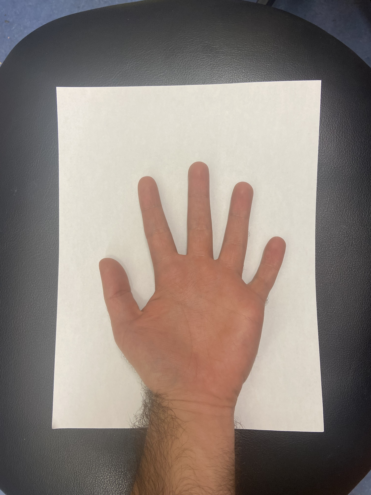

## Step 2: Create Binary Mask

Place the image you took of your hand in the root of this directory. Open the jupyter notebook, run the first cell to import the required libraries, and set the "originalHand" variable to the name of the image file.

Run the first cell (Crop Hand to Paper)

A cropped version of the photo will be saved to "croppedHand.jpg". Open this in a photo editor of your choice and create a binary hand mask representing the hand's contour (instructions below for Photoshop)

In Photoshop, select a first outline of the hand using the object selection tool abd select the button to create a mask from your selection

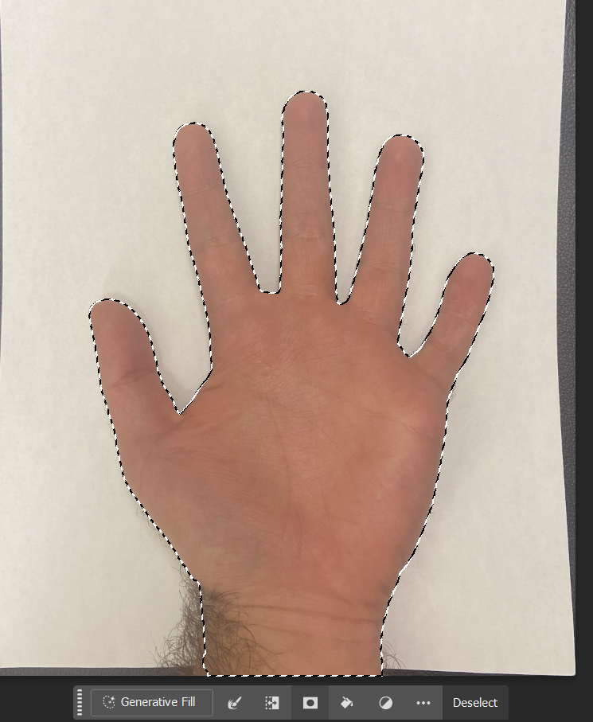

Edit the mask you've selected using whatever tools you want. Add cutouts (using the brush tool) between the fingers and along bending regions for increased flexibility. Correct the thumb area to account for the photo taken at an off angle. 

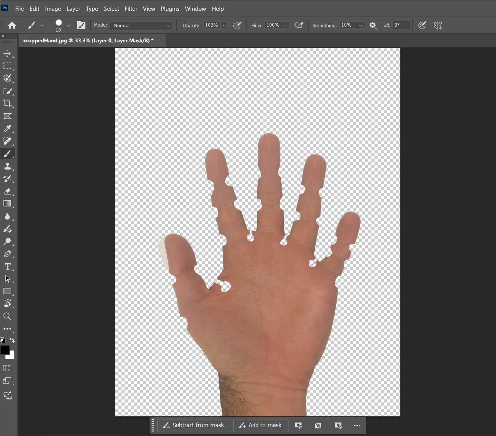

Right-click the mask in the layers panel and select "Add mask to selection"
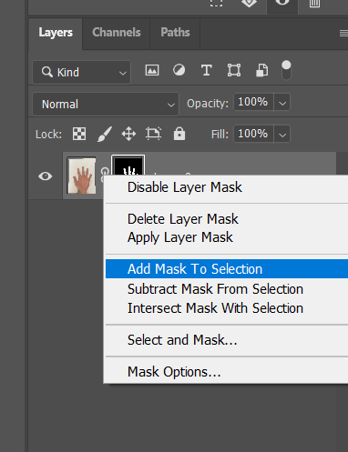

Create a Hue-Saturation adjustment layer and set the lightness to 100
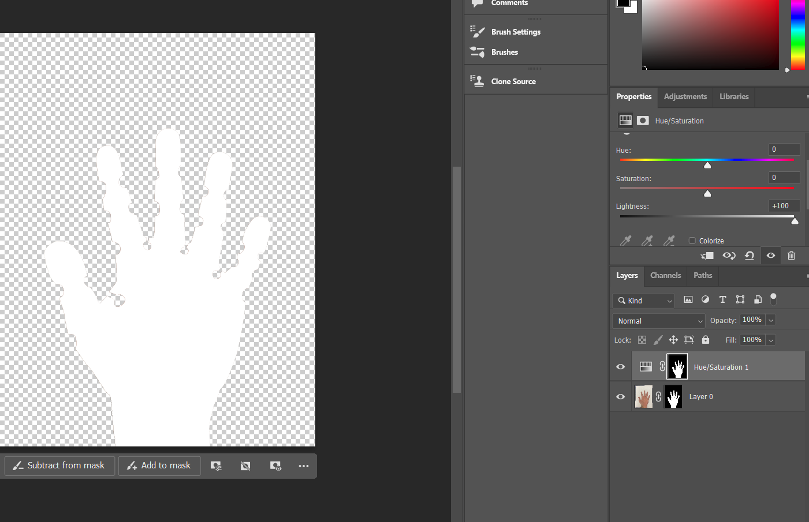

Invert the original mask and add it to selection
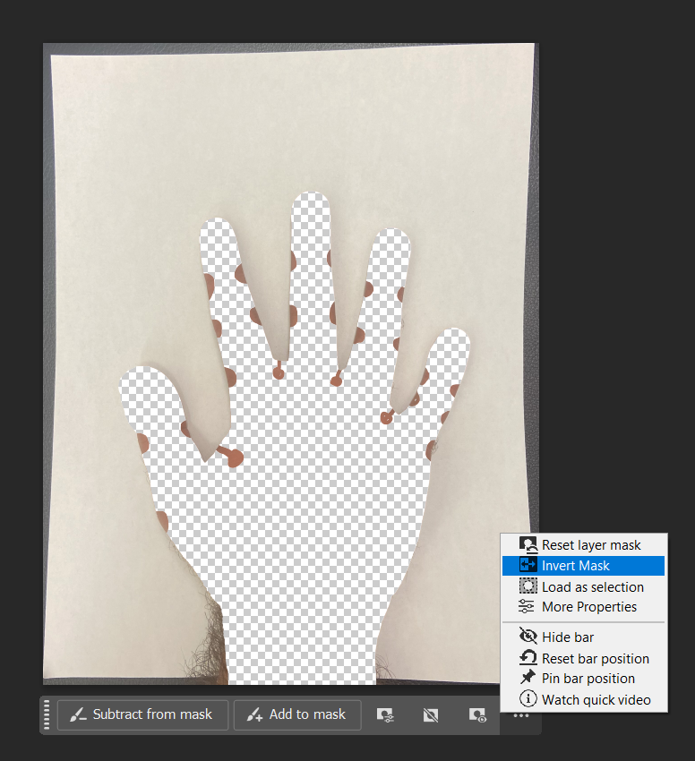

Create another Hue-Saturation adjustment layer and set the lightness to 0. Delete the original mask (so that the bottom layer has no masks directly attached)
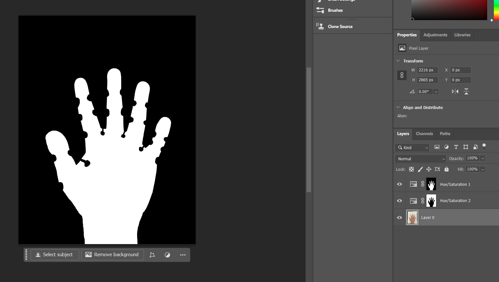

Save the final file in the root directory of this repo

## Step 3: Configure Sensing Regions

Set the variable "cropped_mask_path" to the filename of the hand mask you just made. Run the following cells up to and including "Sensing Region Widget"

The code automatically tries to lay out the sensing regions by various geometric operations. This is not perfect, so there is a gui to help drag the vertices of each sensing region. Make sure each vertex lies within the hand contour and outside bending regions, and that contact points are contained within the sensing regions. When satisfied, click save. 

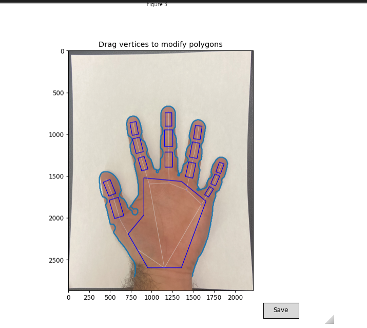

## Step 4: Create Kicad Footprint

Run the remaining code under "Extrude the contour and connect all traces" and "Create SVG and KiCad Mod". This will create two footprints, handFront and handBack, representing the two PCBs you must order to make a sensor.

## Step 5: Prepare the footprints for ordering

Open one of the footprints in KiCad using the footprint editor. Add vias to the bottom of the tracks (0.35 diameter, 0.15 hole). Save the footprint to a library.

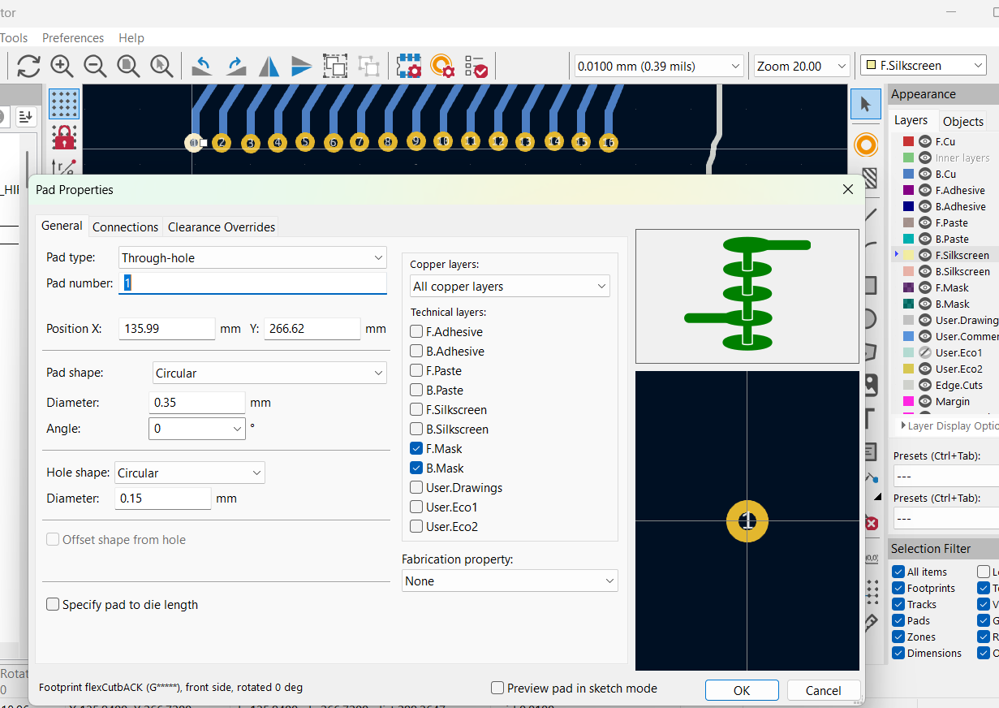

Also download and import the connector footprint: https://www.digikey.com/en/models/5132522 

Create a new project and open the PCB editor. 

Import the hand footprint and place it in the editor (you may want to set the page settings to portrait to accomodate it). 

Then import the connector and place it below the ends of the vias you just added, on the opposite side of the copper traces of the hand. Connect the pads of the connector to the vias using the route tracks tool. 

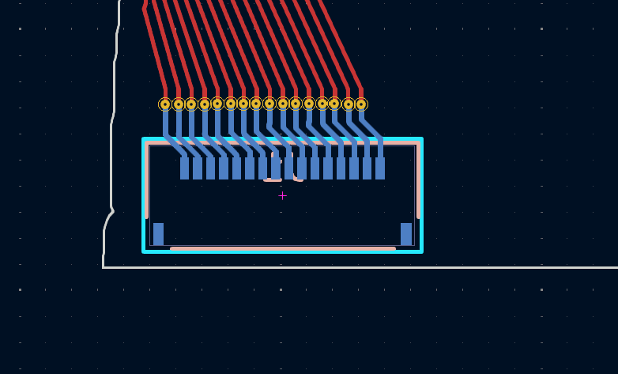

When all tracks are connected, export the gerber and drill files under File > Fabrication Outputs > Gerbers. Make sure the User.Eco1 layer is selected, as this is the adhesive that the manufacturer will need to deposit. Click Plot, and then Generate Drill Files > Plot. 

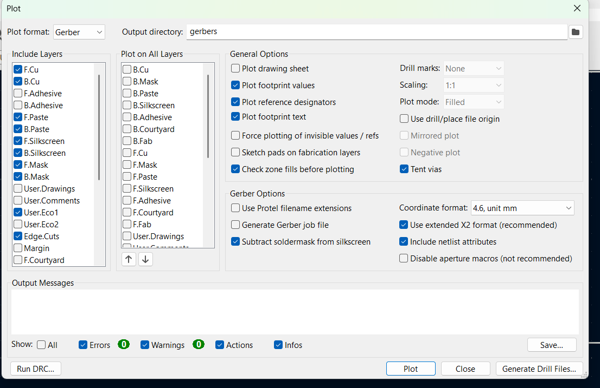

## Step 6: Order from Manufacturer

Go to the pcbway instant quote tool: https://www.pcbway.com/flexible.aspx

Enter the size of the footprint (rough estimate using the measure tool in KiCad is fine).

Most of the default options are fine. Make sure 
- 2 sided is selected
- Board thickness 0.08mm
- 3M/Tessa Tape -> One-sided (Same side as copper tracks(opposite side of connector). Front Cu Tracks= One-sided top)

In the special request box, be sure to specify
- Adhesive should go in the area defined by User.Eco1 layer
- Please use Rolled-Annealed Copper
- Please leave off surface finish

The engineer will likely reccomend you to put surface finish on because the copper will oxidize- we encapsulate it in silicone so this is not a problem for us, and bare copper is more flexible. Tell them no surface finish is fine. 

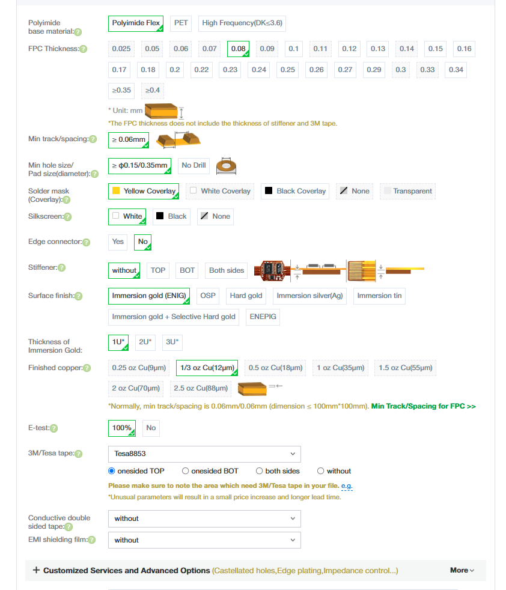

## Known Issues

During the final connection of traces, you may get the error "Multipolygon object has no attribute exterior". Decreasing the min_trace_spacing by 0.01 seems to avoid this error. 

Why this is happening I'm not quite sure of yet, my hypothesis is some part of the contour is folding over on itself when being "extruded inward" causing a hole to form. 
